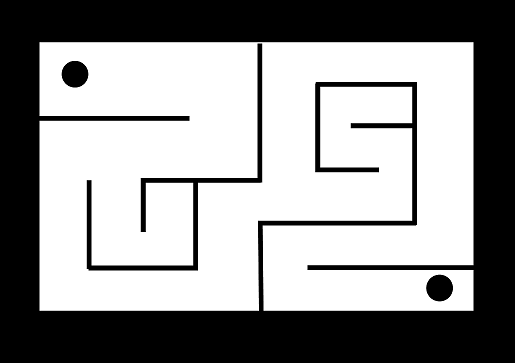
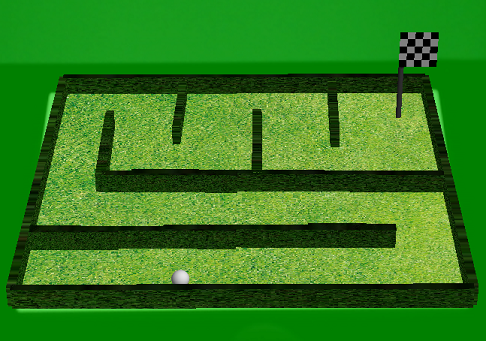
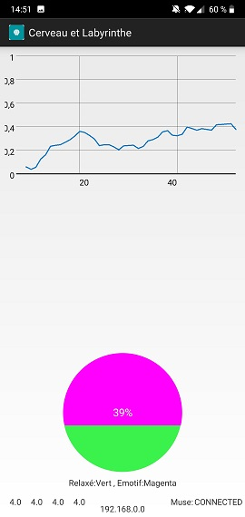
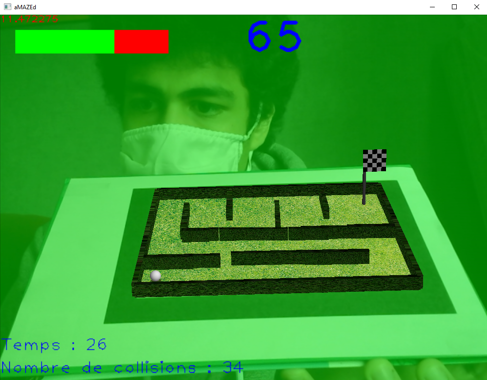
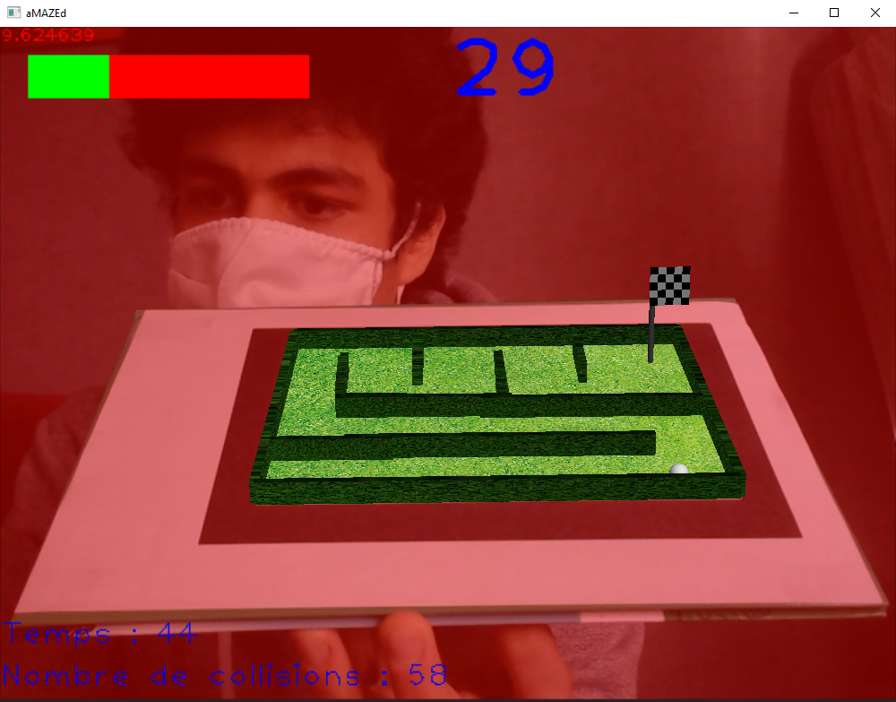

<h1 align="center">
​    Muse Labyritnhe
</h1>

Muse-Labyrinthe est un projet d'école.
Ce projet est le fruit d'une fusion entre deux projets existants. Leurs descriptions ci-dessous.

## Labyrinthe

Le Labyrinthe est un projet d'imagerie. Dans un premier temps, sur une feuille en papier, il faut dessiner un labyrinthe avec des normes à respecter. Comme ceci :

Ensuite, il faut placer cette feuille devant la caméra de l'ordinateur, qui va modéliser le labyrinthe en 3D sur la feuille comme ceci:

Enfin, on doit faire rouler la balle qui se trouve sur le labyrinthe, on l'oriente en penchant la feuille. La balle doit arriver jusqu'au drapeau.

## Muse Émotion
Ce projet utilise le casque Muse. Ce casque permet de connaître le taux de stress d'une personne. Le projet est une application Androïd permettant à un utilisateur de visualiser son taux de stress.

## But
Notre but est de pouvoir visualiser en temps réel le niveau de stress sur l'écran du labyrinthe. Pour cela, le projet Muse Émotion nous permet de recevoir les données de stress et le labyrinthe devra avoir un système de recommandation suivant le niveau de stress de l'utilisateur. 

## Résultat

|            Calme            |            Stress             |         
| :-------------------------: | :-------------------------: | 
|  |  | 

## Déploiement

### Labyrinthe

Pour faire marcher ce projet, [cliquez ici](https://github.com/alextranchinsu/Muse-Labyrinthe/tree/main/Labyrinthe)

### Android

Pour faire marcher ce projet, [cliquez ici](https://github.com/alextranchinsu/Muse-Labyrinthe/tree/main/MuseAndroid)
